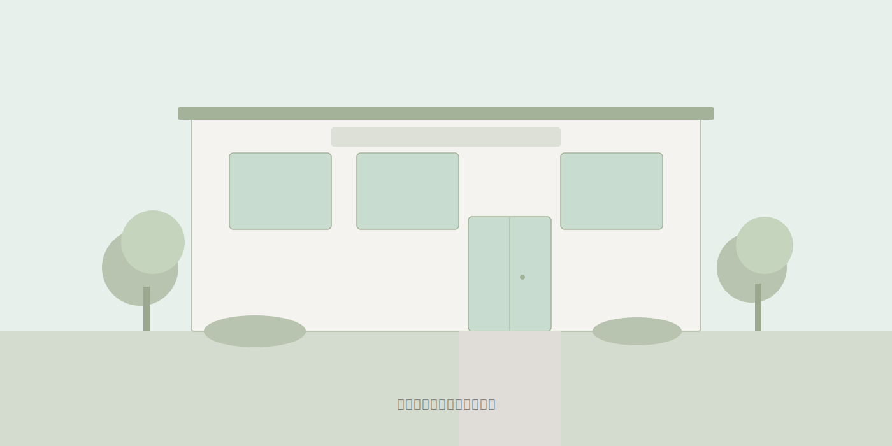

# 辻堂がじゅまる歯科 — 開業前プレサイト

2026年9月開院予定の歯科医院の告知用プレサイト（1ページ完結）です。

---

## 公開手順（GitHub Pages）

1. このフォルダを GitHub リポジトリとして作成・プッシュする
2. GitHub リポジトリの **Settings → Pages** を開く
3. **Source** を `Deploy from a branch` に設定
4. **Branch** を `main`（または `master`）、フォルダを `/ (root)` に設定
5. **Save** をクリック
6. 数分後に `https://<ユーザー名>.github.io/<リポジトリ名>/` で公開される

### 独自ドメインを使う場合

1. GitHub Pages の Settings → Pages → **Custom domain** にドメインを入力
2. DNS 側で CNAME レコードを `<ユーザー名>.github.io` に設定
3. 必要に応じて `CNAME` ファイルをリポジトリのルートに追加

---

## ファイル構成

```
/
├── index.html          ← メインページ
├── css/
│   └── style.css       ← スタイルシート
├── js/
│   └── main.js         ← JavaScript（メニュー・スクロール・フォーム）
├── images/
│   ├── hero-exterior.svg   ← 外観完成予想図（プレースホルダー）
│   ├── doctor.svg          ← 院長写真（プレースホルダー）
│   ├── clinic-reception.svg ← 待合室イメージ（予備）
│   └── clinic-room.svg     ← 診療室イメージ（予備）
└── README.md           ← このファイル
```

---

## 画像の差し替え方法

### 手順

1. 差し替えたい画像を `images/` フォルダに入れる
2. `index.html` を開き、該当する `` タグの `src` 属性を変更する

### 対象箇所

| 用途 | 現在のファイル | HTML内の目印 |
|------|---------------|-------------|
| ヒーロー外観 | `images/hero-exterior.svg` | `class="hero__bg"` を検索 |
| 院長写真 | `images/doctor.svg` | `class="greeting__photo"` 内の `` |

### 例

```html
<!-- 変更前 -->


<!-- 変更後 -->

```

### OGP 画像の更新

画像を差し替えたら、`index.html` の `<head>` 内にある OGP タグも更新してください。

```html
<meta property="og:image" content="images/hero-exterior.jpg">
```

---

## AI 画像生成プロンプト（参考）

実写に差し替えるまでの仮画像を AI で生成する場合の推奨プロンプトです。

### 外観完成予想図（3案から選定）

**案A: スタンダード**
```
Architectural visualization of a modern Japanese dental clinic exterior,
two-story building, clean white and light wood facade, large glass entrance,
small green sign reading dental clinic in Japanese, sidewalk with small
landscaping, natural daylight, photorealistic, eye-level perspective,
residential neighborhood in Kanagawa Japan
```

**案B: ナチュラル**
```
Exterior photo of a warm and inviting small dental clinic in a Japanese
residential area, cream-colored walls with wood accents, potted plants near
entrance, automatic glass doors, clean modern design, not too luxurious,
friendly neighborhood feel, daytime, photorealistic
```

**案C: グリーン重視**
```
Japanese dental clinic exterior with abundant greenery, low hedges and
small trees around a modern two-story cream building, welcoming glass
entrance, bicycle parking area visible, suburban Kanagawa neighborhood,
daytime natural light, architectural photo style
```

### 待合室（2案から選定）

**案A:**
```
Interior of a modern Japanese dental clinic waiting room, light wood
flooring, soft green and beige color scheme, comfortable chairs, children's
book corner visible, natural light from large window, clean and warm
atmosphere, not overly luxurious, photorealistic
```

**案B:**
```
Cozy dental clinic reception area in Japan, white walls with warm wood
accents, simple sofa seating, small reception counter, potted plant,
magazine rack, gentle overhead lighting, welcoming family-friendly feel,
interior photography style
```

### 診療室（2案から選定）

**案A:**
```
Modern dental treatment room in Japan, single dental chair, overhead
light, monitor display, clean white and green color scheme, window with
natural light, organized instrument tray, professional but not intimidating,
photorealistic interior
```

**案B:**
```
Bright and clean dental operatory in a Japanese clinic, dental unit with
patient chair, ceiling-mounted light, small window with curtain, pastel
green accents, minimal and tidy, warm lighting, patient perspective view
```

### 院長ポートレート

```
Professional portrait of a friendly Japanese male dentist in his 30s-40s,
wearing white dental coat, warm smile, standing in a clean clinic setting,
soft natural lighting, upper body shot, approachable and trustworthy
expression, not overly posed
```

---

## テキストの編集方法

`index.html` をテキストエディタで開き、該当箇所を直接編集してください。
各セクションは `<!-- ====== セクション名 ====== -->` のコメントで区切られています。

### よく編集する箇所

| 内容 | 検索キーワード |
|------|---------------|
| 医院名 | `辻堂がじゅまる歯科` |
| 開業予定日 | `2026年9月` |
| 住所 | `藤沢市辻堂1-00-00` |
| 電話番号 | `0466-XX-XXXX` |
| 院長あいさつ | `<!-- ====== 院長ごあいさつ ====== -->` の直後 |
| 診療時間 | `info__schedule` を検索 |

---

## Formspree の設定方法

1. [Formspree](https://formspree.io/) でアカウントを作成
2. 新しいフォームを作成し、通知先メールアドレスを設定
3. 発行されたフォームID（`f/xxxxxxxx` 形式）をコピー
4. `index.html` 内の `FORM_ID_HERE` を実際のIDに置換する

```html
<!-- 変更前 -->
<form action="https://formspree.io/f/FORM_ID_HERE" ...>

<!-- 変更後 -->
<form action="https://formspree.io/f/abcd1234" ...>
```

---

## Google Maps の差し替え方法

正式住所が決まったら、地図の埋め込みURLを更新します。

1. [Google Maps](https://www.google.com/maps) で正式住所を検索
2. 「共有」→「地図を埋め込む」→ HTMLコードをコピー
3. `index.html` 内の `<iframe src="...">` を差し替える
4. 地図下の注記「※ 地図は仮の位置です〜」を削除する

```html
<!-- 変更前 -->
<iframe src="https://www.google.com/maps?q=辻堂駅&output=embed" ...>

<!-- 変更後（正式住所） -->
<iframe src="https://www.google.com/maps?q=神奈川県藤沢市辻堂X-XX-XX&output=embed" ...>
```

---

## カラー変更方法

`css/style.css` の先頭にある `:root` ブロックで全体のカラーを管理しています。

```css
:root {
  --color-primary: #6B9E7D;        /* メインカラー（やわらかいグリーン） */
  --color-primary-dark: #5A8A6B;   /* メインカラー濃い版 */
  --color-primary-light: #EBF3EE;  /* メインカラー薄い版 */
  --color-accent: #D4915E;         /* アクセントカラー（やさしいオレンジ） */
  --color-accent-hover: #C07D4A;   /* アクセント ホバー時 */
  --color-bg: #FFFFFF;             /* 背景色 */
  --color-bg-alt: #F9F7F4;         /* 背景色（交互セクション） */
  --color-text: #3A3A3A;           /* 本文テキスト */
  --color-text-light: #777777;     /* 補助テキスト */
}
```

カラーコード（`#` で始まる値）を変更すれば、サイト全体に反映されます。

---

## 内覧会情報の更新方法

`index.html` 内で `<!-- ====== 内覧会のご案内 ====== -->` を検索し、以下を編集します。

### 日程が決まった場合

```html
<!-- 変更前 -->
<dd>決まり次第お知らせいたします</dd>

<!-- 変更後 -->
<dd>2026年8月29日（土）・30日（日）</dd>
```

同様に「時間」「ご予約」の `<dd>` を更新してください。

---

## 開業日の更新方法

「2026年9月」は複数箇所に表示されています。
`index.html` で `2026年9月` を検索し、すべて更新してください。

表示箇所:
- ヘッダーバッジ
- ヒーローセクション
- 医院情報セクション
- `<title>` タグ
- OGP `<meta>` タグ

`css/style.css` や `js/main.js` には開業日のテキストはありません。

---

## ローカルでの確認方法

### 方法1: ファイルを直接開く
`index.html` をブラウザにドラッグ＆ドロップするだけで表示できます。

### 方法2: ローカルサーバーで確認
```bash
# Python がインストールされている場合
cd gajumaru-dental-presite
python -m http.server 8080

# Node.js がインストールされている場合
npx serve .
```

ブラウザで `http://localhost:8080` を開いてください。
