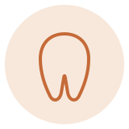

# 独立レビュー結果（Fable 5）— 辻堂がじゅまる歯科 本番サイト honban/

実施日: 2026-06-12
方法: 全9ページのHTML/CSS/JS精読 + headless Chromeで実描画を検証（デスクトップ1440px / ノート1180px / モバイル実寸390px。モバイルはheadlessの最小ウィンドウ幅クランプ(484px)を回避するため390px iframeハーネスで実測）。
依頼者側の評価・既存レビュー資料（SITE_REVIEW.md等）は未読のまま独立評価。

---

## 1. 全体評価

| 軸 | 点数 | 一言 |
|---|---|---|
| デザイン | 6.5 / 10 | 清潔・破綻なし・世界観の方向は正しい。ただし「上位の歯科サイト」と並べると、トップの診療案内・ヒーロー・装飾の質（影/グラデ/動き）で一段見劣りする |
| コンテンツ（文言） | 6 / 10 | dental-anxiety系の短文（「痛かったら、すぐ止めます。」）は競合に勝てる強さ。一方トップの特徴・院長挨拶は全国どの医院でも使える常套句で、「がじゅまる」の固有性がゼロ |
| 技術（CSS・コード） | 7 / 10 | BEM一貫・preload/lazy・focus-visible など基礎は高水準。modern CSS（clamp / :has() / scroll-driven / reduced-motion）が未使用で、旧テーマの残骸・微バグが数点 |

総評: 「減点が少ないサイト」にはなっているが「加点があるサイト」になっていない。構造とコードの土台が良いので、見出しタイポ・トップ診療カード・ヒーローの3点を磨くだけで印象は大きく変わる。

---

## 2. 優先度別の改善提案

### High

#### H-1. トップ「診療案内」カードが視覚的に最弱（フッターのリンク列に見える）
- **問題**: `index.html` の `.service-card` はテキスト＋1px罫線のみ。`images/svc-*.svg`（services.htmlでは使用中）がトップでは使われていない。ファーストビュー直後に来る最重要セクションが一番痩せている。
- **改善**: 既存svc SVGをカードに載せ、hoverで「葉が色づく」マイクロインタラクションを追加。罫線＋余白方針は維持。
```html
<a href="services.html#general" class="service-card">
  
  <h3 class="service-card__title">一般歯科</h3>
  ...
```
```css
.service-card__icon { width:64px; height:64px; margin-bottom:4px;
  filter: grayscale(.2); transition: filter .3s ease, transform .3s ease; }
.service-card:hover .service-card__icon { filter: none; transform: translateY(-3px); }
.service-card { border-top: 2px solid transparent;
  background: linear-gradient(#0000,#0000) padding-box,
              linear-gradient(to right, transparent, var(--color-border), transparent) border-box; }
.service-card:hover { border-top-color: var(--color-primary); }
```

#### H-2. セクション見出しがブランド書体になっていない
- **問題**: `.section__title`（style.css:146）に `font-family` 指定がなく Noto Sans JP で描画。Zen Maru Gothic は下層タイトルや一部にしか使われず、トップの「ごあいさつ」「当院の特徴」…が無個性なゴシックのまま。「テンプレ臭」の主因のひとつ。
- **改善**: 全section__titleを丸ゴ＋流体サイズ＋詰め組みに。
```css
.section__title {
  font-family: var(--font-display);
  font-size: clamp(1.5rem, 1.2rem + 1.5vw, 2rem);
  font-feature-settings: "palt";
  letter-spacing: 0.06em;
}
```
- 767px境界でのジャンプ指定（2319行）は削除できる。

#### H-3. ヒーローの「2026年9月 開院予定」がモバイルで「予/定」と折り返す（実測確認済み）
- **問題**: `.hero__date` が固定3rem（モバイル2.25rem）+ letter-spacing 0.12em で、390px実機相当では「2026年9月 開院予\n定」になる。最初に目に入る要素での組版事故。
- **改善**:
```css
.hero__date {
  font-size: clamp(1.75rem, 4.5vw + 0.9rem, 3rem);
  word-break: auto-phrase;       /* Chrome 119+。非対応でも害なし */
}
.hero__date .nb { white-space: nowrap; }  /* HTML側: <span class="nb">開院予定</span> */
```

#### H-4. 下層ページヒーローの写真がほぼ見えない
- **問題**: `.page-hero__overlay` の白オーバーレイが 0.86–0.93（style.css:1518）。せっかくの画像背景ヒーローが「薄ベージュの帯」にしか見えない（news/about等で確認）。
- **改善**: 全面均一の白幕をやめ、テキスト側だけ濃い方向性グラデに。
```css
.page-hero__overlay {
  background: linear-gradient(105deg,
    rgba(255,250,246,.96) 0%, rgba(255,250,246,.88) 46%,
    rgba(255,250,246,.45) 78%, rgba(255,250,246,.15) 100%);
}
```
- 中央寄せをやめ左寄せにすると右側に写真の「抜け」ができ、密度と抜けのリズムが生まれる。

#### H-5. 準備中「WEB予約」ボタンのアクセシビリティと行き止まり
- **問題**: `.reserve__btn--epark` は `pointer-events:none` だが `<a href="#">` のまま。pointer-eventsはキーボードを止めないため、Tabでフォーカス→Enterでページ先頭へジャンプする。また右端レールの「WEB予約」→ #reserve に飛んだ先のWEB予約も準備中で、導線が行き止まり。
- **改善**: 準備中の間は `<a>` をやめる。
```html
<span class="reserve__btn reserve__btn--epark" aria-disabled="true">
  <span class="reserve__btn-label">WEB予約</span>
  <span class="reserve__btn-sub">（準備中）</span>
</span>
```
- レール側は開院前の実態に合わせ「WEB予約（準備中）」表記にするか、当面ラベルを「ご予約案内」に変える。

#### H-6. `prefers-reduced-motion` がCSSに一切ない
- **問題**: JSカルーセルは配慮済みなのに、CSS側の `scroll-behavior:smooth` / `.fade-in` / hover transform が対象外。前庭障害ユーザーへの標準配慮が欠落。プロ制作のサイトでは今や必須項目。
- **改善**（一括で安全側に）:
```css
@media (prefers-reduced-motion: reduce) {
  html { scroll-behavior: auto; }
  *, *::before, *::after {
    animation-duration: .01ms !important;
    transition-duration: .01ms !important;
  }
  .fade-in { opacity: 1; transform: none; }
}
```

#### H-7. フォームのフォーカスリングが旧テーマの緑（バグ）
- **問題**: style.css:1178 `box-shadow: 0 0 0 3px rgba(107,158,125,.15)` — プレサイト（緑茶系）の残骸。暖色の世界観の中で入力欄にフォーカスすると緑が出る。787行（.open-house、未使用）にも同色の残骸。
- **改善**:
```css
box-shadow: 0 0 0 3px rgba(197,106,56,.18);
```

### Medium

#### M-1. ヘッダーのモダン化（backdrop-filter）
- 現状 `rgba(255,255,255,.97)` のベタ白。1行で「2026年のサイト」になる:
```css
.header { background-color: rgba(255,250,246,.78);
  -webkit-backdrop-filter: blur(10px) saturate(1.5);
  backdrop-filter: blur(10px) saturate(1.5); }
```

#### M-2. fade-inの単調さ → stagger＋CSSスクロール連動
- 全要素同一の0.6s/translateY(20px)単発。同一セクション内の子要素に時差を付けるだけで質感が出る:
```css
.features .features__item:nth-child(2) { transition-delay: .12s; }
.features .features__item:nth-child(3) { transition-delay: .24s; }
```
- 将来的にはJS不要のscroll-driven animationsへ（プログレッシブ・エンハンスメント）:
```css
@supports (animation-timeline: view()) {
  @media (prefers-reduced-motion: no-preference) {
    .fade-in { opacity:0; transform:translateY(20px);
      animation: rise both; animation-timeline: view();
      animation-range: entry 0% entry 40%; }
    @keyframes rise { to { opacity:1; transform:none; } }
  }
}
```

#### M-3. 影トークンの多層化（暖色チント）
- `--shadow` 一種＋黒ベースのad hoc影。上位サイトは「黒くない影」を使う:
```css
--shadow-sm: 0 1px 2px rgba(120,72,40,.06), 0 2px 8px rgba(120,72,40,.06);
--shadow-md: 0 2px 4px rgba(120,72,40,.05), 0 8px 24px rgba(120,72,40,.10);
--shadow-lg: 0 4px 8px rgba(120,72,40,.06), 0 18px 48px rgba(120,72,40,.16);
```

#### M-4. カルーセルのa11y矛盾
- `carousel__dots` に `aria-hidden="true"`（index.html:198）だが、JSが中に `aria-label` 付きの `<button>` を生成。aria-hidden内のフォーカス可能要素はWCAG違反。dotsを操作UIとして残すなら `aria-hidden` を外し `role="tablist"` 相当に、装飾とするなら `tabindex="-1"` に統一。
- `.carousel__track` への `aria-live="polite"`（自動送り停止中のみ）も検討。

#### M-5. news.html の記事リンクが `href="#"`
- main.jsのsmooth scrollは `#` を素通しするため、クリックでページ先頭へジャンプ。記事ページができるまでは `<a>` を `<span>` にするか `href` を外す（aはhref無しでもvalid）。
- ついでに: index.html と news.html でダミー記事の日付・件名が不一致（05.20/05.10 vs 07.01/07.15）。仮データでも正本を一致させておかないと、実データ移行時の混入事故のもと。

#### M-6. services.html の見出し二重化
- 目次カードの「一般歯科」等が `<h2>`（services.html:96-116）で、本文セクションにも同名 `<h2>`（171-235行）。同一ページに同じh2が2回ずつ並ぶ。目次側は見出しではなくリンクラベルなので `<span class="service-card__title">` に降格が正しい（CSSはクラス指定なので影響なし）。

#### M-7. `background-attachment: fixed`（body）の罠
- iOS Safariでは `fixed` が効かず再描画ジャンクの原因にもなる。固定背景を保つなら疑似要素方式へ:
```css
body { background: #FBF8F3; }
body::before { content:""; position: fixed; inset: 0; z-index: -1;
  background:
    radial-gradient(58vw 58vw at 102% -8%, rgba(197,106,56,.07), transparent 62%),
    radial-gradient(50vw 50vw at -8% 26%, rgba(247,232,219,.55), transparent 60%),
    radial-gradient(46vw 46vw at 96% 88%, rgba(247,232,219,.45), transparent 60%); }
```

#### M-8. OGP画像が2.3MBのPNG＋パス不整合
- `og:image` は `https://gajumaru-dental.com/images/hero-director.png`（honban外・2.3MB）。SNSクローラーには重すぎ、かつルート昇格時の構成によっては404。1200×630のJPEG/WebP（〜200KB）を別途用意し `honban/images/ogp.jpg` を参照すべき。あわせて未使用のPNGマスター群（clinic-*.png等 計約12MB）はデプロイから除外。

#### M-9. 文言: トップ「当院の特徴」が無個性（before/after）
- before: 「01 家族で通いやすい環境 / 02 相談しやすい診療 / 03 通いやすい立地」— どの医院にも貼れる。
- after（例・固有名詞と具体で差別化）:
  - 01 「がじゅまる」の木のように、根を張る medical home — *沖縄で「家族を守る木」と呼ばれるガジュマル。子どもからおじいちゃんまで、家族の歯を一本の木のように長く見守ります。*
  - 02 治療を始める前に、まず話す — *初日は検査と説明まで。何をするか・いくらかかるかを先にお伝えし、納得してから始めます。*
  - 03 辻堂駅から徒歩3分 — *お買い物や通勤のついでに寄れる場所。続けやすさも治療の一部と考えています。*
- ポイント: 「環境を整えています」「心がけます」という述語をやめ、行動の宣言（〜します／〜しません）に置き換える。dental-anxietyページの文体（強い）をトップへ輸出するのが最短。

#### M-10. 文言: 院長挨拶のテンプレ感（before/after）
- before: 「研鑽を積んでまいりました」「ご納得いただいたうえで一緒に進めていく診療」
- after（例）: 「勤務医時代、治療台の上で緊張している方をたくさん見てきました。説明が足りないまま進む治療が、人を歯医者から遠ざける。そう感じたことが、この医院をつくる理由です。」
- 実取材後の差し替え前提でも、「構造」として 体験 → 気づき → 開院理由 の3段で書く雛形にしておくと取材がそのまま文章になる。

#### M-11. FAQの「もちろんです。」反復
- 5問中2問が「もちろんです。」で始まる。回答の頭は質問の繰り返しではなく結論の言い換えに: 「相談だけでも行っていいですか？」→「はい、相談だけで帰る方も珍しくありません。」

### Low

- **L-1. dead CSS掃除**: `.open-house` ブロック（764-811行・全ページ未使用）、`.reserve__btn--line` / `.side-reserve__btn--line`（LINE撤去後の残骸）、`facility.html` の `data-img` 属性（参照なし）。約80行削減。
- **L-2. ブレークポイント不統一**: 本体は767px、`.carousel`/`.service-detail`は768px。768px端末（旧iPad縦）で両者の適用が割れる。767pxに統一。
- **L-3. 電話アイコンSVGのコピペ6箇所以上**: `<symbol id="i-tel">`＋`<use>`化、もしくは最低限CSSのmask-imageで一元化。
- **L-4. フッターの低コントラスト**: `rgba(255,255,255,.45)`の注記・`.35`のコピーライトは実効3:1未満でAA不達。`.6`程度へ。
- **L-5. skip link なし**: `<a class="skip-link" href="#main">本文へ</a>` を全ページ先頭に。固定ヘッダーサイトでは効果大。
- **L-6. ハンバーガーメニュー**: Escで閉じない・フォーカストラップなし。20行程度のJSで対応可能。
- **L-7. 細部の品**: `::selection { background: var(--color-primary-light); }`、`accent-color: var(--color-primary);`、`<meta name="theme-color" content="#FBF6F0">`、リンクに `text-underline-offset: .2em`。
- **L-8. モバイルの予約グリッド**: 767px以下で2列のため3つ目「フォーム」が孤立wrap。`grid-template-columns: 1fr 1fr 1fr` の1列落とし（`@media (max-width:480px){ grid-template-columns:1fr; }`）か、3列維持で文字を縮める。
- **L-9. 「（仮）」144箇所の運用**: 公開時の消し忘れリスク。`<span class="tbd">（仮）</span>` に統一しておけば、確定時に一括検索・削除でき、開発中だけ `.tbd{background:#ff0}` で目視確認もできる。
- **L-10. _partials コメントの乖離**: モバイルバーは「3枠」と書かれているが実装は2枠。正本コメントを実態に合わせる。

---

## 3. 競合に勝つために特に効く Top 5（投資対効果順）

1. **トップ診療案内カードへのアイコン＋hover演出（H-1）** — ファーストビュー直後の最弱セクションが30分の作業で「設計されたページ」に変わる。svc SVGは既にある。
2. **見出しのZen Maru統一＋clamp流体化（H-2, H-3）** — 1ルールで全9ページの印象が締まる。「暖色×木」の世界観は書体で完成する。
3. **ヒーローの磨き込み（H-3＋コピー）** — 「家族で通いやすい歯科医院を目指して」は弱い。例: 「怖くない、を当たり前に。— 辻堂駅徒歩3分、家族の歯医者」。anxietyバナーの強いコピーとトーンを揃える。
4. **stagger＋reduced-motion＋ヘッダーblur（M-1, M-2, H-6）** — 動きの質はプロと自作を分ける一番分かりやすい指標。合計50行以内。
5. **「がじゅまる」ストーリーの明文化（M-9, M-10）** — 医院名の由来（家族を守る木）はこのサイトだけの資産なのに、現状どこにも書かれていない。医療広告ガイドラインに一切抵触せず差別化できる唯一の素材。トップに3行＋aboutに1セクション。

---

## 4. 視覚クオリティを底上げするCSS技法集（今すぐ足せるもの）

```css
/* 1) 流体タイポスケール — 全見出しのジャンプ廃止 */
:root {
  --fs-h2: clamp(1.5rem, 1.2rem + 1.5vw, 2rem);
  --fs-h3: clamp(1.0625rem, 1rem + .4vw, 1.25rem);
}

/* 2) 日本語の改行品質 — 見出しの文節折返しと孤立文字防止 */
h1, h2, h3, .hero__date { word-break: auto-phrase; }   /* Chrome系 */
.section__title { text-wrap: balance; }
p { text-wrap: pretty; }   /* 段落末尾の1文字泣き別れ軽減 */

/* 3) 暖色チントの多層影（→ M-3のトークン） */

/* 4) 罫線のグラデ化 — 「罫線＋余白」方針のまま線の質だけ上げる */
.info__row, .news-list__item, .promise, .steps__item {
  border-image: linear-gradient(to right,
    transparent, var(--color-border) 12%, var(--color-border) 88%, transparent) 1;
}

/* 5) :has() でフォームの能動的フィードバック */
.form-group:has(:focus-visible) .form-label { color: var(--color-primary-dark); }
.form-group:has(:user-invalid) .form-input { border-color: #C0392B; }

/* 6) 画像の質感 — placeholder段階から効く */
.facility-item__media { position: relative; border-radius: var(--radius-lg); overflow: hidden; }
.facility-item__media::after { content:""; position:absolute; inset:0;
  box-shadow: inset 0 0 0 1px rgba(120,72,40,.08), inset 0 -24px 48px rgba(120,72,40,.06);
  border-radius: inherit; pointer-events: none; }
.facility-item__media img { transition: transform .6s ease; }
.facility-item:hover img { transform: scale(1.03); }

/* 7) セクション境界の有機化 — leaf-branchの「向き・位置」をセクションごとに変える */
.section--alt:nth-of-type(odd)::after { right:auto; left:-34px; transform: rotate(-8deg) scaleX(-1); }

/* 8) ページ遷移をSPA風に（静的サイトのままで） */
@view-transition { navigation: auto; }   /* Chrome/Edge。非対応は通常遷移 */

/* 9) カルーセル画像の連続性 */
.carousel__slide img { aspect-ratio: 16 / 10; height: auto; }
```

補足:
- (8) View Transitionsはhead内CSSのみで効く。9ページの回遊体験が一気に滑らかになる。コスト1行・リスクなしで「他院がやっていない」枠。
- 上の(2)(5)(8)はすべてプログレッシブ・エンハンスメント。非対応ブラウザで壊れない。

---

## 5. やってはいけない／不要な提案

1. **カードUI（背景＋影＋囲い）への全面回帰は不要** — 罫線＋余白方針自体は視覚品質を損ねていない。むしろ競合の「白カード敷き詰めLP」と差別化できている。問題は罫線型の「線と余白の質」が未調整なことで、§4(4)のグラデ罫線と影トークンで解決する。方針は維持が正解。
- 例外1箇所: `.reserve__btn` だけは既にカード型。ここは行動ボタンなので囲い続行でよい。
2. **症例写真・ビフォーアフター・患者の声・体験談の追加提案はしない**（医療広告ガイドライン上の方針通り）。FAQと「4つの約束」が実質その代替として機能しており、構造として正しい。
3. **青系・寒色系への配色変更はしない**（同町競合と被る方針通り）。現パレットのコントラスト実測は本文系すべてAA通過で、変える理由がない。
4. **フレームワーク／ビルドツール導入は現時点で不要** — 9ページ・手動partials運用は実測で全ページ一致しており破綻していない。news記事が月次で増え始めて初めてEleventy等を検討すればよい。AOS等のアニメライブラリも不要（§4のCSSで足りる）。
5. **ヒーロー動画・重いパララックスは入れない** — LCP悪化に対しリターンが薄い。preload済みのwebpヒーロー＋グラデ改善で十分戦える。

---

## 検証メモ（依頼者側の統合用）

- モバイル実寸390pxでハンバーガー・診療時間表・固定バーはすべて正常描画（当初headlessの最小ウィンドウ幅クランプで「ハンバーガー消失」に見えたが、撮影アーティファクトと特定済み。サイト側のバグではない）。
- 実バグとして確認したのは: H-3（「予/定」折返し）、H-5（準備中ボタンのキーボードフォーカス）、H-7（緑フォーカスリング）、M-4（aria-hidden内のbutton）、M-5（news `href="#"`）、L-4（フッターコントラスト）。
- 手動partials運用は全8サブページでヘッダー/フッター/予約/NAP完全一致を確認。aria-current の差し替えも全ページ正しい。
